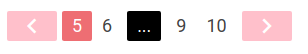

# react_paginator

[](https://npmjs.org/package/react_paginator)

### Bootstrap theme


### Materialize theme


### Custom materialize theme


React-Paginator is a react component to create a great and easy to use pagination system.
You can customize it to adapt to your style

### Usage

Three steps to start with react_paginator ;)

#### Install
`npm i --save react_paginator`

#### Import
`import Paginator from 'react_paginator'`

#### Add to DOM
```javascript
<Paginator>
  // Elements on what you want to paginate
</Paginator>
```

### Example with MaterializeCSS

```javascript
<Paginator 
  prevIcon={<i className="material-icons">chevron_left</i>} 
  nextIcon={<i className="material-icons">chevron_right</i>}
  liClass="waves-effect">

  // Elements...

</Paginator>
```

### Props

| Name    | Type    | Description                                      | Default Value |
|---------|---------|--------------------------------------------------|---------------|
| perPage | Integer | Number of elements you want to show on each page | 1 |
| bsClass | String | Base class of pagination system | pagination |
| prevIcon | Node | Previous page icon | null |
| nextIcon | Node | Next page icon | null |
| pageClass | String | Li element class | null |
| pageNextClass | String | Next (li) element class | null |
| pagePrevClass | String | Previous (li) element class | null |
| pageNextLinkClass | String | Next link element class (a) | null |
| pagePrevLinkClass | String | Previous link element class (a) | null |
| blankClass | String | [...] element class | null |
| showOnly | Integer | Number of pages to show | 5 |
